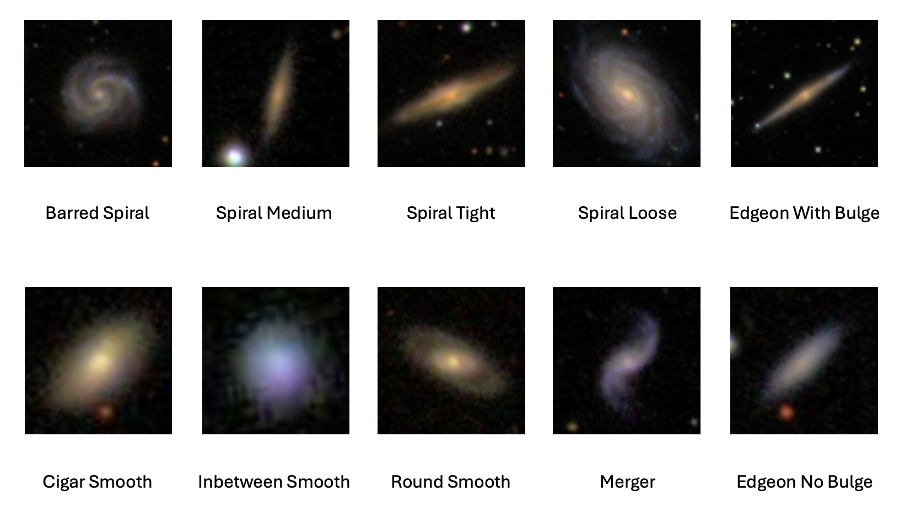
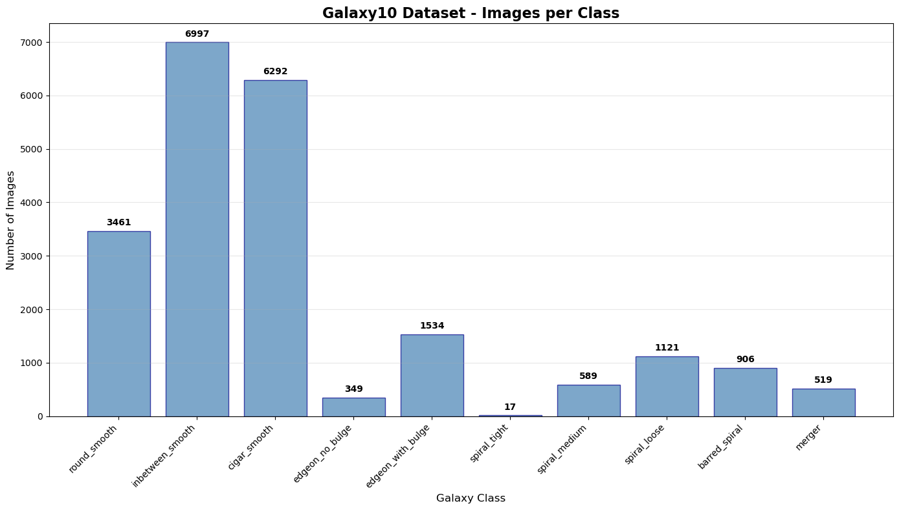
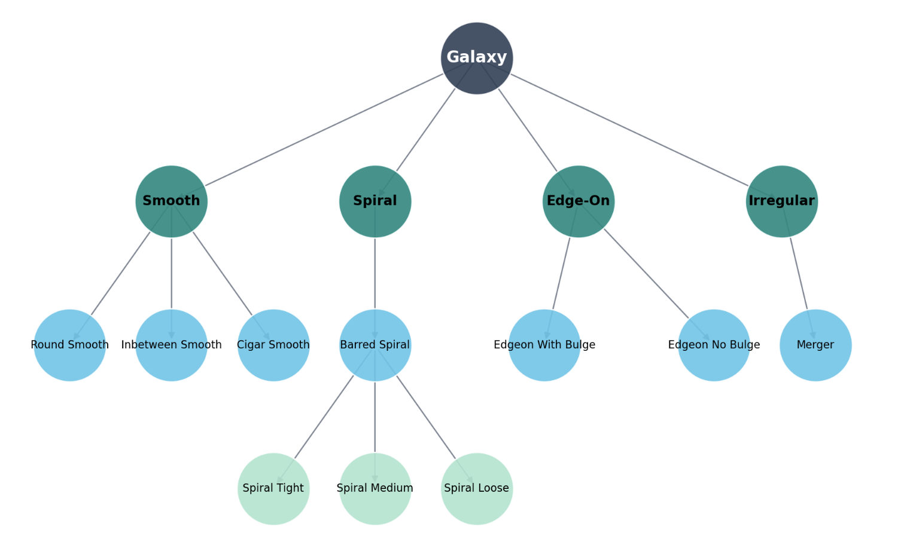
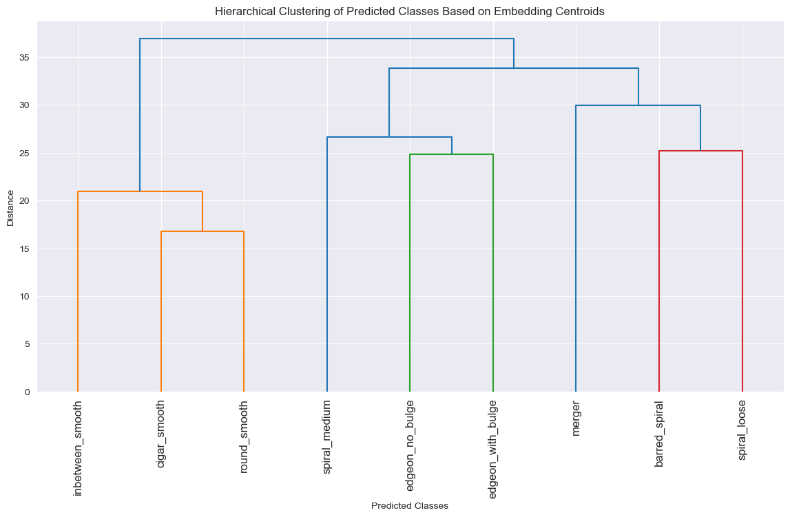
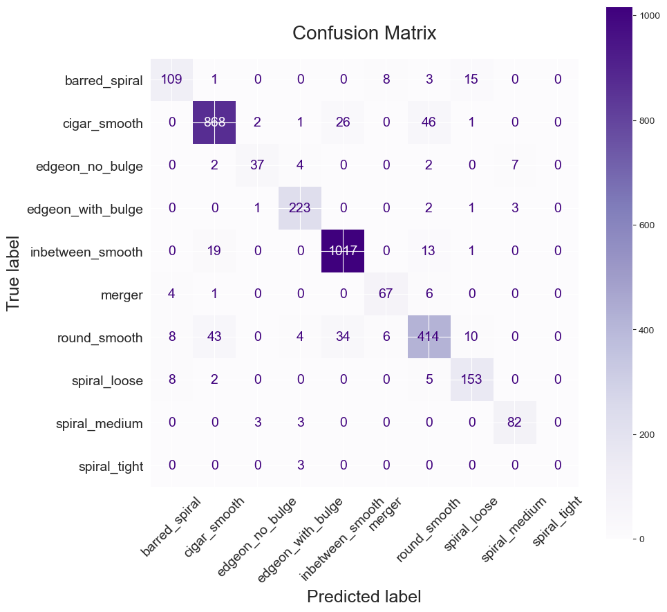
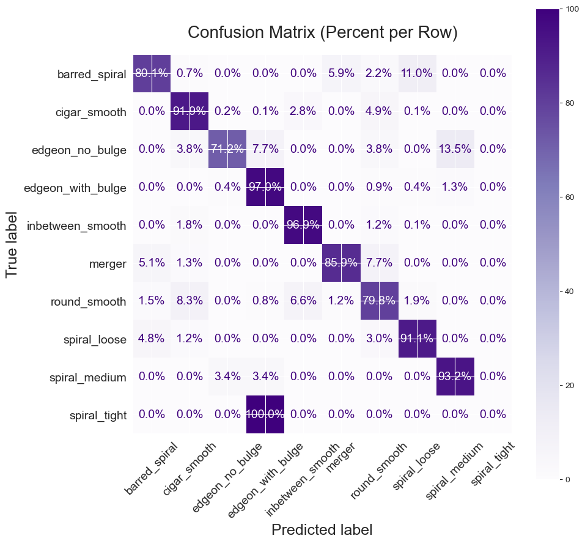

# Galaxy Classification with Classical Machine Learning on Galaxy10

This project evaluates a broad range of machine learning models on the Galaxy10 dataset—comparing classical classifiers trained on pretrained embeddings to end-to-end convolutional neural networks. The results show that classical models can achieve competitive performance when high-quality features are used.

---

## Required Files (External Downloads)

To reproduce the results in this repository, please download the following files and place them in the specified directories:

- `Galaxy10.h5` → `Data_Processing/`
- Raw PNG images → `Galaxy10_Images/`
- Feature vectors (`.npz`) → `Galaxy10_Embedding_vectors/`

Download link for external resources:  
https://www.dropbox.com/scl/fo/siokphup3et0mgp21s3jm/AEjAB50RxawW854G8WdOBUc?rlkey=uits1px0w148vfmdixae04z26&dl=0
---

## Galaxy10 Classes

The dataset includes 21,785 galaxy images labeled into the following 10 morphological categories:

---

## Summary of Results

| Model                          | Accuracy | Balanced Acc. | Precision | Recall | F1 Score |
|-------------------------------|----------|----------------|-----------|--------|----------|
| Dummy (Most Frequent)         | 0.3213   | 0.1000         | 0.0321    | 0.1000 | 0.0486   |
| AdaBoost                      | 0.8268   | 0.6930         | 0.7640    | 0.6930 | 0.7199   |
| K-Nearest Neighbors           | 0.8807   | 0.7550         | 0.7617    | 0.7550 | 0.7578   |
| Logistic Regression (OvO)     | 0.8797   | 0.7571         | 0.7711    | 0.7571 | 0.7635   |
| Logistic Regression (OvR)     | 0.8797   | 0.7530         | 0.7682    | 0.7530 | 0.7596   |
| Support Vector Machine (OvO)  | 0.8819   | 0.7493         | 0.7778    | 0.7493 | 0.7622   |
| Support Vector Machine (OvR)  | 0.8791   | 0.7529         | 0.7710    | 0.7529 | 0.7611   |
| Random Forest                 | 0.8807   | 0.7516         | 0.7749    | 0.7516 | 0.7621   |
| XGBoost                       | 0.8724   | 0.7412         | 0.7676    | 0.7412 | 0.7531   |
| Hard Voting Ensemble          | 0.8837   | 0.7527         | 0.7728    | 0.7527 | 0.7614   |
| Soft Voting Ensemble          | 0.8804   | 0.7501         | 0.7728    | 0.7501 | 0.7601   |
| ResNet-50 (end-to-end)        | 0.9088   | 0.7869         | 0.9071    | 0.9088 | 0.9076   |
| ResNet-101 (end-to-end)       | 0.8977   | 0.7718         | 0.8969    | 0.8977 | 0.8969   |

---

## Embedding Comparison Using K-Nearest Neighbors

To evaluate the impact of feature quality, we trained a K-Nearest Neighbors classifier on embeddings generated from different vision models—including ViTs, CLIP, DINOv2, and ResNet-101 (with and without fine-tuning). For each embedding source, we performed hyperparameter tuning to select the optimal value of k, allowing us to fairly isolate the influence of the embeddings themselves.

| Embedding Source              | Accuracy | Balanced Acc. | Precision | Recall | F1 Score |
|------------------------------|----------|----------------|-----------|--------|----------|
| ViT (ImageNet only)          | 0.6325   | 0.4515         | 0.6117    | 0.4515 | 0.4907   |
| ViT (fine-tuned on Galaxy10) | 0.8602   | 0.7192         | 0.7410    | 0.7192 | 0.7279   |
| CLIP ViT-B/32                | 0.6147   | 0.4270         | 0.6005    | 0.4270 | 0.4487   |
| DINOv2 ViT                   | 0.6043   | 0.4446         | 0.5707    | 0.4446 | 0.4738   |
| ResNet-101 (ImageNet only)   | 0.5884   | 0.3949         | 0.5018    | 0.3949 | 0.4142   |
| ResNet-101 (fine-tuned on Galaxy10)      | **0.8807** | **0.7750**   | **0.7617**| **0.7550** | **0.7578** |

**Conclusion**: Fine-tuning on Galaxy10 consistently yielded significantly better results, proving that even simple models like KNN can perform well if the feature space is task-specific.

---

## Model Explanations

- **Dummy Classifier**  
  A baseline model that always predicts the most frequent class, regardless of input.  
  **Accuracy**: 32.1% | **Balanced Accuracy**: 10.0%

- **AdaBoost**  
  An ensemble method that builds a sequence of weak learners (typically shallow decision trees), each focusing more on the mistakes of the previous ones.  
  **Accuracy**: 82.7% | **Balanced Accuracy**: 69.3%

- **K-Nearest Neighbors (KNN)**  
  A non-parametric model that assigns labels based on the majority vote of the k closest training samples in the embedding space.  
  **Accuracy**: 88.1% | **Balanced Accuracy**: 75.5%

- **Logistic Regression (OvO / OvR)**  
  A linear classifier that estimates class probabilities using the logistic function; extended to multi-class settings using One-vs-One (OvO) and One-vs-Rest (OvR) schemes.  
  **Accuracy**: 87.9% | **Balanced Accuracy**: ~75.3–75.7%

- **Support Vector Machine (OvO / OvR)**  
  A powerful classifier that finds the optimal hyperplane to separate classes with maximum margin, using an RBF kernel for nonlinear boundaries; extended to multi-class via OvO/OvR.  
  **Accuracy**: 88.2% (OvO) | **Balanced Accuracy**: 74.9%

- **Random Forest**  
  An ensemble of decision trees where each tree is trained on a random subset of features and data samples, improving robustness and reducing overfitting.  
  **Accuracy**: 88.1% | **Balanced Accuracy**: 75.2%

- **XGBoost**  
  A gradient boosting method that builds an ensemble of trees sequentially, each correcting the previous one’s errors. It includes regularization and GPU acceleration.  
  **Accuracy**: 87.2% | **Balanced Accuracy**: 74.1%

- **Hard Voting Ensemble**  
  Combines multiple classifiers by selecting the class with the majority of votes from all individual models.  
  **Accuracy**: 88.4% | **Balanced Accuracy**: 75.3%

- **Soft Voting Ensemble**  
  Aggregates the predicted probabilities from multiple classifiers and selects the class with the highest average probability.  
  **Accuracy**: 88.0% | **Balanced Accuracy**: 75.0%

- **ResNet-50 (End-to-End CNN)**  
  A deep convolutional neural network trained directly on RGB images, learning both features and classifier weights simultaneously.  
  **Accuracy**: 90.9% | **Balanced Accuracy**: 78.7%

- **ResNet-101 (End-to-End CNN)**  
  A deeper version of ResNet-50 with more layers, offering greater capacity for feature learning at the cost of higher computational demand.  
  **Accuracy**: 89.8% | **Balanced Accuracy**: 77.2%
- 
---

## Class Distribution

The Galaxy10 dataset is **highly imbalanced**. Some classes such as "Inbetween Smooth" and "Cigar Smooth" contain thousands of samples, while others like "Spiral Tight" contain fewer than 20. This imbalance can skew models toward majority classes and degrade performance on rare categories.

To mitigate this, we applied data augmentation to minority classes during training only, ensuring equal class representation. Validation and test sets remained untouched to preserve fairness.

---

## Morphological Structure

Galaxy morphologies fall into semantically meaningful groups:
- **Smooth**: Round, Inbetween, Cigar — different ellipticities
- **Spiral**: Barred Spiral, Spiral Tight/Medium/Loose — variations in arm structure
- **Edge-On**: With Bulge / No Bulge — observed edge-on with differing bulge prominence
- **Irregular**: Merger — chaotic systems with interaction artifacts

This hierarchy reflects physical processes such as formation, orientation, and interaction, and provides a framework for understanding model confusion patterns.

---

## Hierarchical Clustering (Embedding Space)

To assess how well classifiers internally represent the morphological relationships between galaxy types, we performed hierarchical clustering on the predicted class centroids (mean embeddings per class).

- **Classical models**: Show clear, meaningful groupings—e.g., smooth galaxies cluster together, spirals are close in space
- **CNNs**: Despite high accuracy, embeddings were more chaotic and less interpretable
- **Conclusion**: Classical models may provide more explainable representations, even if not as accurate

This suggests that interpretability and accuracy are not always aligned and motivates further research on embedding interpretability.

---

## Confusion Matrices (ResNet-50)

| Raw Counts | Normalized Percentages |
|------------|-------------------------|
|  |  |

The class `Spiral Tight` was consistently misclassified as `Edgeon No Bulge`, which likely results from both visual similarity and its extreme underrepresentation in the dataset (only 17 examples in total).

---

## Summary

- Classical ML models, when paired with fine-tuned embeddings, performed surprisingly well (up to 88.4% accuracy)
- End-to-end CNNs achieved the highest accuracy (90.9%) but at the cost of interpretability
- Clustering shows classical models respect semantic relationships; CNNs do not
- Class imbalance continues to affect rare class performance, even with augmentation

---

## Future Work

- Use higher-resolution images to capture more details
- Apply transformer-based models or hybrid attention architectures
- Investigate loss functions that explicitly target rare class accuracy
- Explore dimensionality reduction or interpretability-focused embedding strategies